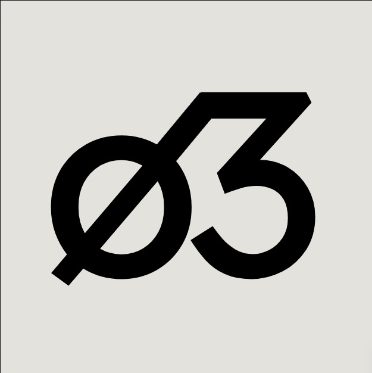

# Silicønja or ø3
Small Map for All Chemical Elements

**ø3** is a by student & for students web application which is a **student-focused chemistry reference** designed to provide structured, accurate, and visual information for all **118 chemical elements**. It emphasizes visual-perception, scientific clarity, standardized data representation, and symbol-based learning aligned with modern chemistry curricula. It is highly responsive and can be viewed in any platform without glitches.

It organizes elements using **consistent schemas**, including atomic properties, electronic configuration, reactivity patterns, and periodic classification. This makes it suitable not only for conceptual learning but also for analytical understanding of periodic trends and chemical behavior.

The platform integrates **symbol-centric + visuals** notations with scientifically grounded descriptions, enabling faster recall and improved association between symbols, identity, and properties. Visual representations are optimized for educational use without sacrificing technical & conceptual accuracy.

This platform is specifically built with a **work-ready mindset**, ensuring that all data are predictable, extensible, and compatible with web-based educational tools. It serves as both a learning aid for students and a reliable reference layer for chemistry-focused applications.

The app is actively maintained and is constantly checked by the developer itself.

-ø3
